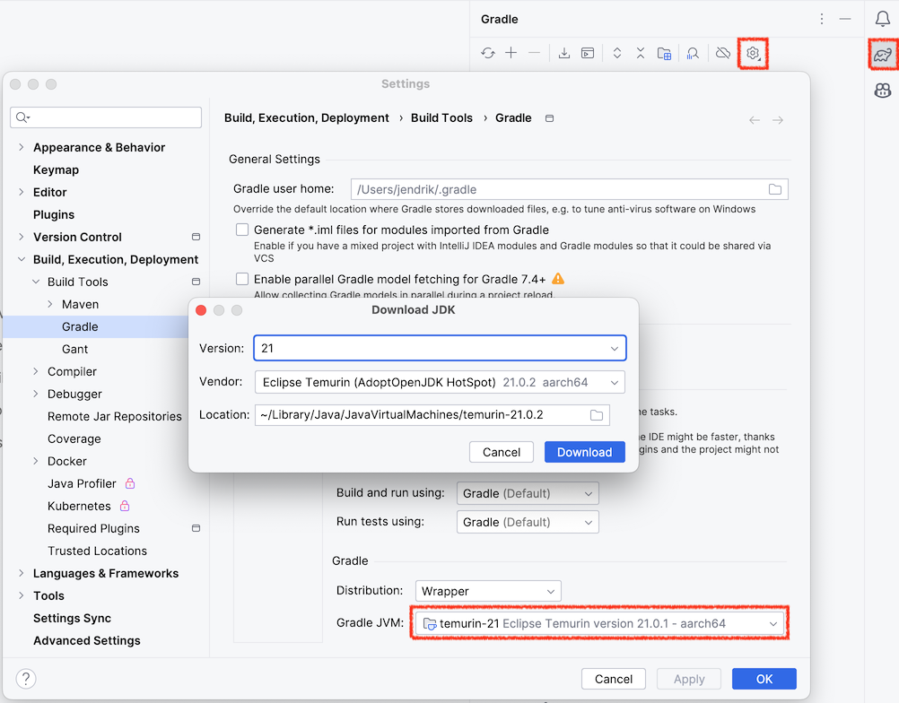
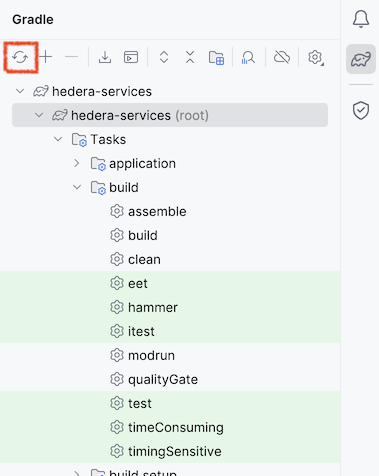
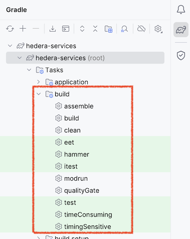

[](https://actions-badge.atrox.dev/hiero-ledger/hiero-gradle-conventions/goto?ref=main)
[](https://plugins.gradle.org/plugin/org.hiero.gradle.build)
[](LICENSE)
[](https://scorecard.dev/viewer/?uri=github.com/hiero-ledger/hiero-gradle-conventions)
[](https://bestpractices.coreinfrastructure.org/projects/10697)

# Hiero Gradle Conventions

Gradle [convention plugins](https://docs.gradle.org/current/samples/sample_convention_plugins.html) used by Hiero projects.

Any Gradle-based Java project that uses the Java Module System (JPMS) may use these convention plugins.
That includes projects that are not part of the Hiero organisation. The conventions follow latest Gradle best practices
and ensure compatibility with performance features such as the
[Remote Build Cache](https://docs.gradle.com/build-cache-node/) and the
[Configuration Cache](https://docs.gradle.org/current/userguide/configuration_cache.html).
The convention plugins pull in a [curated set of third-party Gradle plugins](build.gradle.kts#L12-L29)
that also support these features and are compatible with the latest Gradle version.

## ToC

- [Using the Convention Plugins](#using-the-convention-plugins) (for project maintainers)
- [List of Convention Plugins](#list-of-convention-plugins) (for project maintainers)
- [Building a project that uses these plugins](#building-a-project-that-uses-these-plugins) (for developers)
  - [From the command line](#from-the-command-line)
  - [In IntelliJ](#in-intellij)
  - [In GitHub Actions](#in-github-actions)
- [Defining modules and dependencies in a project that uses these plugins](#defining-modules-and-dependencies-in-a-project-that-uses-these-plugins) (for developers)
- [Contributing / changing plugins themselves](#contributing) (for project maintainers)

<a name="plugins"></a>

## Using the Convention Plugins

Apply the entry point plugin `org.hiero.gradle.build` in the `settings.gradle.kts` file.  Additionally, define where
Modules (subprojects) are located in the directory hierarchy by using the `javaModules { ... }` notation
(which is provided by the [org.gradlex.java-module-dependencies](https://github.com/gradlex-org/java-module-dependencies?tab=readme-ov-file#project-structure-definition-when-using-this-plugin-as-settings-plugin) plugin).

```kotlin
// settings.gradle.kts
plugins {
    id("org.hiero.gradle.build") version "0.6.0"
}

// Define location of Modules (subprojects)
javaModules {
    directory("product-a") { // searches for 'module-info.java' in subfolders of 'product-a'
        group = "org.example.product-a"
    }
}
```

In each Module (subproject), apply one of the `org.hiero.gradle.module.*` plugins and, if desired, additional
`org.hiero.gradle.feature.*` plugins.

For example, to define a Library Module that also provides _test fixtures_ and has _JMH benchmarks_, the plugins block
should look like this:

```kotlin
plugins {
    id("org.hiero.gradle.module.library")
    id("org.hiero.gradle.feature.test-fixtures")
    id("org.hiero.gradle.feature.benchmark")
}
```

### Project structure

There is a [minimal example](example) setup.

```
├── settings.gradle.kts                          // Entriy point (see above)
├── gradle.properties                            // Turn on Gradle caches
├── gradle/aggregation/build.gradle.kts          // List of all product/service modules for consistent resolution
├── gradle/toolchain-versions.properties         // JDK version (and other tools if applicable)
├── gradle/wrapper/gradle-wrapper.properties     // Gradle version (defined through Gradle wrapper)
├── hiero-dependency-versions/build.gradle.kts   // Versions of 3rd-party modules
├── product-a                                    // Folder containing all modules of 'product-a'
│   ├── module-app                               // Example of a Application module
│   │   ├── build.gradle.kts                     // Select which build features to use in 'plugins {}' (see above)
│   │   └── src/main/java/module-info.java       // Define dependencies to other modules
│   ├── module-lib                               // Example of a Library module
│   │   ├── build.gradle.kts                     // Select which build features to use in 'plugins {}' (see above)
│   │   └── src/main/java/module-info.java       // Define dependencies to other modules
│   └── description.txt                          // Description of the product (for published metadata),
│                                                //   or set 'description' for individual module in build.gradle.kts
└── version.txt                                  // Version of all modules/products
```

## List of Convention Plugins

The plugins are written in Gradle's Kotlin DSL and are found in [src/main/kotlin](src/main/kotlin).
Each plugin has a short description located in [src/main/descriptions](src/main/descriptions).

Each plugin configures a certain build aspect, following this naming pattern:

- `org.hiero.gradle.base.*` _Base_ plugins need to be used in all Modules to establish a certain foundation
  for the setup. For example, the same dependency management configuration should be applied everywhere to
  consistently use the same 3rd party libraries everywhere.
- `org.hiero.gradle.feature.*` Each _feature_ plugin configures one aspect of building the software –
  like compiling code or testing code.
- `org.hiero.gradle.check.*` _Check_ plugins help with keeping the software maintainable over time.
  They check things like the dependency setup or code formatting.
- `org.hiero.gradle.report.*` _Report_ plugins configure the export of information into reports that can be picked
  up by other systems - e.g. for code coverage reporting.
- `org.hiero.gradle.module.*` _Module_ plugins combine plugins from all categories above to define
  _Module Types_ that are then used in the `build.gradle.kts` files of the individual Modules of our software.

<a name="build"></a>

## Building a project that uses these plugins

## From the command line

Run `./gradlw` to get the list of tasks that are useful to check and test local changes:

```
Build tasks
-----------
assemble - Assembles the outputs of this project.
build - Assembles and tests this project.
qualityGate - Apply spotless rules and run all quality checks.
test - Runs the test suite.
```

In addition, the following build parameters may be useful:

|  Task  |               Parameter                |                          Description                           |                Remarks                 |
|--------|----------------------------------------|----------------------------------------------------------------|----------------------------------------|
| `test` | `-PactiveProcessorCount=<proc-number>` | not run tests in parallel and reduce number of processors used |                                        |
| `jmh`  | `-PjmhTests=<includes>`                | select benchmarks to run - e.g. `com.example.jmh.Benchmark1`   | only projects with `feature.benchmark` |

## In IntelliJ

Open the root folder of the project in IntelliJ. It is automatically recognized as Gradle project and imported.

### Configure the JDK used by Gradle

Before you can use all features reliably, make sure that Gradle is started with the JDK used in the project.
The JDK version of the project is defined in `gradle/toolchain-versions.properties`.

You can use IntelliJ to download the JDK if you do not have it installed.



## Reload Project with Gradle

After you changed something in the project setup you should press the **Reload All Gradle project** in IntelliJ.
Changes to the project setup include:

- Changing build setup/plugins in `build.gradle.kts` files
- Changing dependencies in `src/main/java/module-info.java` files
- Changing dependency versions in `hiero-dependency-versions/build.gradle.kts`



## Build, test, run through Gradle tasks

You can run all tasks (see [command line](#from-the-command-line)) from the Gradle tool window.
Usually, you only require the tasks listed in the **build** group.



To run only a single test, you can use the _run test_ options offered by IntelliJ when you open a test file.
IntelliJ then automatically constructs the required Gradle call to run the test through Gradle.

## In GitHub Actions

GitHub action pipelines should use the official [setup-gradle action](https://github.com/gradle/actions/) with the following tasks and parameters.

### Building and testing

In a CI pipeline for PR validation with multiple steps use the following.
(The available _test sets_ are determined by the additional `feature.test-*` plugins used in the project.)

|   Task and Parameters    |                              Description                               |
|--------------------------|------------------------------------------------------------------------|
| `./gradlew assemble`     | Build all artifacts (populates remote build cache)                     |
| `./gradlew qualityCheck` | Run all checks except tests                                            |
| `./gradlew test`         | Run all unit tests                                                     |
| `./gradlew <test-set>`   | Run all tests in _test-set_ (possibly on different agents in parallel) |

Alternatively, if you are fine to do more in one pipeline step, you can use:

|  Task and Parameters   |             Description             |
|------------------------|-------------------------------------|
| `./gradlew build`      | `assemble` + `qualiyCheck` + `test` |
| `./gradlew <test-set>` | Run all tests in _test-set_         |

#### Environment

The following environment variables should be populated from _secrets_ to ensure a performant build.

|      Env Variable       |             Description              |
|-------------------------|--------------------------------------|
| `GRADLE_CACHE_USERNAME` | Gradle remote build cache _username_ |
| `GRADLE_CACHE_PASSWORD` | Gradle remote build cache _password_ |

### Code coverage reports

Running `test` produces code coverage data. The following creates a single XML file with all coverage data for upload
to coverage analysis services like Codecov.

|        Task and Parameters         |                 Description                  |
|------------------------------------|----------------------------------------------|
| `./gradlew testCodeCoverageReport` | Generate a single XML with all coverage data |

Report location: `gradle/aggregation/build/reports/jacoco/testCodeCoverageReport/testCodeCoverageReport.xml`

### Publishing

Before doing the publishing, you may need to update the version (version.txt file) in a preceding step.

|                     Task and Parameters                     |               Description                |
|-------------------------------------------------------------|------------------------------------------|
| `./gradlew versionAsSpecified -PnewVersion=<version>`       | Define version to store in version.txt   |
| `./gradlew versionAsSnapshot`                               | Add _-SNAPSHOT_ suffix to version.txt    |
| `./gradlew versionAsPrefixedCommit -PcommitPrefix=<prefix>` | Set version based on current commit hash |

To perform the actual publishing use one of the following:

|                 Task and Parameters                 |                   Description                   |
|-----------------------------------------------------|-------------------------------------------------|
| `./gradlew publishAggregationToCentralPortal`       | Publish artifacts to Maven central (new Portal) |
| `./gradlew publishPlugins --no-configuration-cache` | Publish plugin to Gradle plugin portal          |

The following parameters may be used to tune or test the publishing (default is `false` for all parameters).

|           Task and Parameters           |                         Description                         |
|-----------------------------------------|-------------------------------------------------------------|
| `-PpublishSigningEnabled=<true\|false>` | Set to `true` for actual publishing                         |
| `-PpublishTestRelease=<true\|false>`    | `false` - auto-release from staging when successful         |
| `-Ps01SonatypeHost=<true\|false>`       | Use the `s01.oss.sonatype.org` host if required (old OSSRH) |

The following environment variables should be populated from _secrets_ to ensure a fully functional build.

#### Environment

|      Env Variable       |               Description               |
|-------------------------|-----------------------------------------|
| `NEXUS_USERNAME`        | Maven Central publish _username_        |
| `NEXUS_PASSWORD`        | Maven Central publish _password_        |
| `GRADLE_PUBLISH_KEY`    | Gradle plugin portal publish _username_ |
| `GRADLE_PUBLISH_SECRET` | Gradle plugin portal publish _password_ |

### Testing Rust code on multiple operating systems

If `feature.rust` and `feature.test-multios` is used, you can configure a matrix pipeline to run `test` on multiple
agents with different operating systems. In this case, you can use the following parameter to skip the rust installation
on the test-only agents where compiled code is retrieved from the remote build cache.

|                 Parameters                  |                                 Description                                 |
|---------------------------------------------|-----------------------------------------------------------------------------|
| `-PskipInstallRustToolchains=<true\|false>` | Skip `installRustToolchains` task if all `cargoBuild*` tasks are FROM-CACHE |

<a name="modules"></a>

## Defining modules and dependencies in a project that uses these plugins

The [project structure](#project-structure) endorsed by this setup uses the
[Java Module System (JPMS)](https://www.oracle.com/corporate/features/understanding-java-9-modules.html)
as the primary system for defining _modules_ and their _dependencies_. For a smooth integration of JPMS and Gradle's
dependency management, the `org.gradlex.java-module-dependencies` plugin, and the additional notations it provides, are
utilised. Therefore, the means to define dependencies differ from traditional Gradle-base Java projects.

For more background information please refer to:
- This [video series on Modularity in Java (with Gradle)](https://www.youtube.com/playlist?list=PLWQK2ZdV4Yl092zlY7Dy1knCmi0jhTH3H)
- The [documentation of the `org.gradlex.java-module-dependencies` plugin](https://github.com/gradlex-org/java-module-dependencies)

### Changing or adding modules (aka Gradle subprojects)

A module is defined by adding a
[build.gradle.kts](example/product-a/module-lib/build.gradle.kts)
and [module-info.java](example/product-a/module-lib/src/main/java/module-info.java)
in a [module](example/product-a/module-lib) folder inside the folder that represents the
[product](example/product-a) the module belongs to:

```
└── product-a
    └── module-lib
        ├── build.gradle.kts
        └── src/main/java/module-info.java
```

For Gradle to discover the module, the product directory needs to be registered in
[settings.gradle.kts](example/settings.gradle.kts) in the root of the repository by using the
[notation provided by the `org.gradlex.java-module-dependencies` plugin](https://github.com/gradlex-org/java-module-dependencies?tab=readme-ov-file#project-structure-definition-when-using-this-plugin-as-settings-plugin).
If you add a module to an existing product, this is already done. If you are starting a new product, you have
to add the entry and define the _group_ for all modules of the product. The _group_ is used in publishing modules
to _Maven Central_.

```kotlin
javaModules {
    directory("product") { group = "org.example.product" }
}
```

In the [build.gradle.kts](example/product-a/module-lib/build.gradle.kts) file, you define the type of the module by
using a [_Module_ convention plugin](#list-of-convention-plugins).

```kotlin
plugins { id("org.hiero.gradle.module.library") }
```

There are currently three types:
- **Library Module** You most likely need this: a reusable Java library that can be published
- **Application Module** An application that can be executed (for example a test application)
- **Gradle Plugin Module** A Gradle plugin

If you need to support additional features for the developing of the module, you may add additional
[_Feature_ convention plugins](#list-of-convention-plugins).

### Changing or adding dependencies

With the _Java Module System (JPMS)_, dependencies between modules are
defined in the [src/main/java/module-info.java](example/product-a/module-lib/src/main/java/module-info.java) file
that each module contains. A dependency to another module is defined by a `requires` statement  and the other module
is identified by its _Module Name_ there. For example, a dependency to the `module-a` module is expressed by
`requires org.example.module.a`. A dependency to the 3rd party library `com.fasterxml.jackson.databind` is expressed by
`requires com.fasterxml.jackson.databind`.

Each dependency definition [contains a scope](https://docs.gradle.org/current/userguide/java_library_plugin.html#declaring_module_dependencies)
– e.g. `requires` or `requires transitive`. If you are unsure about a scope, use `requires` when adding a dependency.
Then execute `./gradlew qualityGate` which runs a _dependency scope check_ that analysis the code to determine which
Java types are visible (and should be visible) to which modules. If the check fails, it will advise you how to change
the scope.

#### Adding or changing dependencies if module-info.java is missing

In addition to the production code of a module (located in [src/main/java](example/product-a/module-lib/src/main/java)),
your module will most likely also contain test code (located  in [src/test/java](example/product-a/module-lib/src/test/java)).
From the JPMS perspective, the test code is a separate module, with its own `src/test/java/module-info.java` file.
If possible, you can add this file and use it to define dependencies for the test code.

However, it is not possible to treat tests as separate module if they break the encapsulation of the _main_ module.
This is the case if the tests need access to internals (like _protected_ methods) and are therefore placed in the same
_Java package_ as the _main_ code. This is also referred to as _whitebox testing_.

For such a setup you may omit the additional `module-info.java`. The tests are then executed as traditional
Java tests without enforcing module encapsulation at test runtime. To still keep the dependency notations consistent,
you define `requires` of the test code in the [build.gradle.kts](example/product-a/module-lib/build.gradle.kts) file.

```kotlin
testModuleInfo {
    requires("org.junit.jupiter.api")
}
```

A module may also define more test sets, like `src/testIntgration/java`, by adding the corresponding
[_Feature_ convention plugin](#list-of-convention-plugins) (e.g. `id("org.hiero.gradle.feature.test-integration")`).
It is recommended to treat such tests as separate modules in the JPMS sense (_blackbox_ tests) by adding a separate
`module-info.java`. But it is also possible to not do that and define the `requires` in the `build.gradle.kts` file.

### Adding or changing the version of a 3rd party dependency

If you use a 3rd party module lke `com.fasterxml.jackson.databind`, a version for that module needs to
be selected. For this, the
[hiero-dependency-versions/build.gradle.kts](example/hiero-dependency-versions/build.gradle.kts)
defines a so-called _Gradle platform_ (also called BOM) that contains the versions of all 3rd party
modules used. If you want to upgrade the version of a module, do this here. Remember to run
`./gradlew qualityGate` after the change. If you need to use a new 3rd party module in a
[src/main/java/module-info.java](example/product-a/module-lib/src/main/java/module-info.java) file, you need to
add the version here.
(If the new module is not completely Java Module System compatible, you may also need to add or modify
[patching rules](#patching-3rd-party-modules)).

### Patching 3rd party modules

Some 3rd party libraries are not yet fully Java Module System (JPMS) compatible. And sometimes 3rd party modules pull
in other modules that are not yet fully compatible (which we may be able to exclude). Situations like this are treated as
wrong/incomplete metadata in this Gradle setup and the file
[org.hiero.gradle.base.jpms-modules.gradle.kts](src/main/kotlin/org.hiero.gradle.base.jpms-modules.gradle.kts)
contains the rules to adjust or extend the metadata of 3rd party libraries to address such problems.

An issue in this area only occurs when you add a new 3rd party module that is not fully compatible with JPMS or if you
update an existing dependency such that the update pulls in a new 3rd party module that is not fully compatible.
You will see an error like this:

```
> Failed to transform javax.inject-1.jar (javax.inject:javax.inject:1) to match attributes {artifactType=jar, javaModule=true, org.gradle.category=library, org.gradle.libraryelements=jar, org.gradle.status=release, org.gradle.usage=java-api}.
   > Execution failed for ExtraJavaModuleInfoTransform: /Users/jendrik/projects/gradle/customers/hiero/hiero-gradle-conventions/build/tmp/test/work/.gradle-test-kit/caches/modules-2/files-2.1/javax.inject/javax.inject/1/6975da39a7040257bd51d21a231b76c915872d38/javax.inject-1.jar.
      > Not a module and no mapping defined: javax.inject-1.jar
```

In these cases, first determine if adding the new 3rd party module is really needed/intended. If it is the case,
only an update to these plugins can resolve the issue permanently. Follow the
[guidelines to make local changes to the plugins](#use-local-changes-to-plugins-in-a-project).
Then modify the rules in
[org.hiero.gradle.base.jpms-modules.gradle.kts](src/main/kotlin/org.hiero.gradle.base.jpms-modules.gradle.kts)
as needed. There are two levels of patching:

1. Add missing `module-info.class`:
   This is done through the `org.gradlex.extra-java-module-info` plugin.
   Often it is sufficient to add a simple entry for the affected library. For example, to address the error
   above, you can add `module("javax.inject:javax.inject", "javax.inject")` to the `extraJavaModuleInfo` block.
   For more details, refer to the
   [org.gradlex.extra-java-module-info plugin documentation](https://github.com/gradlex-org/extra-java-module-info).
2. Adjust metadata (POM file) of dependency:
   This is required to solve more severe issues with the metadata of a library using the Gradle concept of
   _Component Metadata Rules_. For a convenient definition of such rules, we use the `patch` notation provided by the
   `org.gradlex.jvm-dependency-conflict-resolution` plugin.
   For more details, refer to the
   [org.gradlex.jvm-dependency-conflict-resolution plugin documentation](https://gradlex.org/jvm-dependency-conflict-resolution/#patch-dsl-block).

If you have a solution that works locally, please [open a PR](https://github.com/hiero-ledger/hiero-gradle-conventions/pulls).
If you are unsure how to resolve an error, please [open an issue](https://github.com/hiero-ledger/hiero-gradle-conventions/issues/new)
that shows how to reproduce it.

## Contributing

Whether you’re fixing bugs, enhancing features, or improving documentation, your contributions are important — let’s build something great together!

Please read our [contributing guide](https://github.com/hiero-ledger/.github/blob/main/CONTRIBUTING.md) to see how you can get involved.

### Making and testing changes

#### Use local changes to plugins in a project

Insert the line
`pluginManagement { includeBuild("<path-to-hiero-gradle-conventions>") }`
in the top of your `settings.gradle.kts`. For example, if this repository is cloned next to the project repository in
your local file system, the top part of your `settings.gradle.kts` should look like this:

```kotlin
// SPDX-License-Identifier: Apache-2.0
pluginManagement { includeBuild("../hiero-gradle-conventions") }

plugins { id("org.hiero.gradle.build") version "<<version>>" }
```

After you inserted that line, reload your project in IntelliJ. You will now see `hiero-gradle-conventions`
next to your project in the workspace. You can now make changes to the files in [src/main/kotlin](src/main/kotlin).
Your changes are automatically used when running a build.

#### Add or adjust a test

Each change done to the plugins should be covered by a test. The tests are located in
[src/test/kotlin](src/main/kotlin). They are written in Kotlin using [JUnit5](https://junit.org/junit5/),
[AssertJ](https://assertj.github.io/doc/) and [Gradle Test Kit](https://docs.gradle.org/current/userguide/test_kit.html).
Each test creates an artificial project that applies the plugin(s) under test, runs a build and asserts build results –
such as: state of tasks executed, console logging, created files. Take a look at the existing tests for more details.

#### Create a PR and get it merged to publish a SNAPSHOT

Once you are satisfied with the changes and tested them locally, you can create a PR in this repository.
Once the PR is merged, a new `SNAPSHOT` version will be published from the `main` branch automatically.

#### Use SNAPSHOT in a PR of another repository

Once the `SNAPSHOT` with the changes is available, you can use it in a PR in another repository.
For that you need to add the Maven Central snapshot repository as a source for plugins.
Temporarily adjust the `settings.gradle.kts` so that the top looks like this:

```kotlin
// SPDX-License-Identifier: Apache-2.0
pluginManagement {
    repositories {
        gradlePluginPortal()
        maven("https://central.sonatype.com/repository/maven-snapshots")
    }
}

buildscript {
    configurations.classpath { resolutionStrategy.cacheChangingModulesFor(0, "seconds") }
}

plugins { id("org.hiero.gradle.build") version "<<next-version>>-SNAPSHOT" }
```

#### Get a new version of the plugins published

Once you are satisified with the changes, ping a maintainer of this reposiotry to perform a release.
When the release is ready, you can remove the snapshot repository again from the PR in the other repository and
switch `org.hiero.gradle.build` to the newly released version.

```kotlin
// SPDX-License-Identifier: Apache-2.0
plugins { id("org.hiero.gradle.build") version "<<new-version>>" }
```

## Help/Community

Join our [community discussions](https://discord.lfdecentralizedtrust.org/) on discord.

## About Users and Maintainers

Users and Maintainers guidelies are located in **[Hiero-Ledger's roles and groups guidelines](https://github.com/hiero-ledger/governance/blob/main/roles-and-groups.md#maintainers).**

## Code of Conduct

Hiero uses the Linux Foundation Decentralised Trust [Code of Conduct](https://www.lfdecentralizedtrust.org/code-of-conduct).

## License

[Apache License 2.0](LICENSE)
